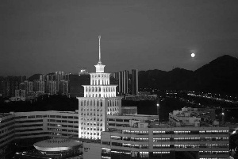
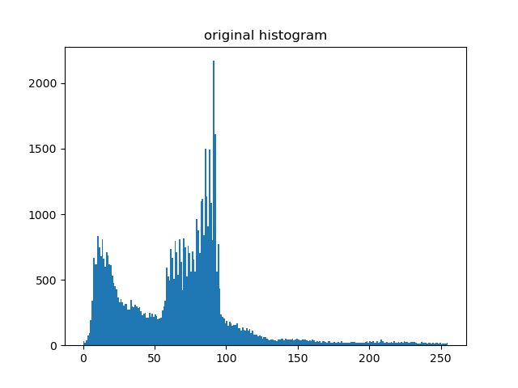
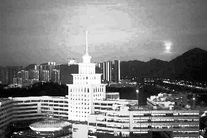
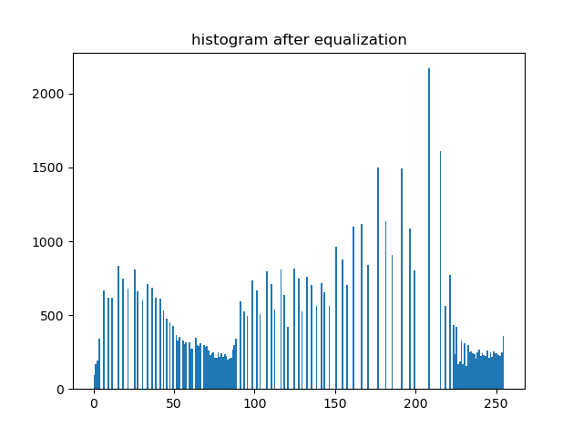
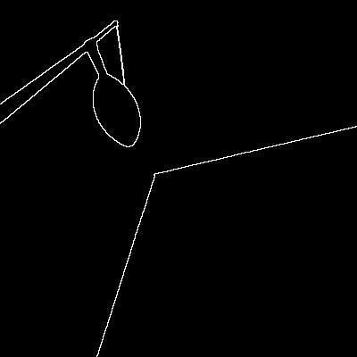

# 2022-DIP-Project1

## 1 Project Content

This project is composed of two tasks: image enhancement and morphology.

In the image enhancement task, we are required to implement the **histogram equalization algorithm** on a gray level image so that the gray levels of the resulting image are more equally distributed than that of the original image. Third party library for key processing steps is forbidden.

In the morphology task, we are required to find the boundary of a binary image using **morphological** approach. However, the given input image is gray level and binarization is needed beforehand. Same as the above task, third party library for key processing steps is forbidden.

## 2 Method Description

### 2.1 Task 1: Image enhancement

**Histogram equalization algorithm** is established on a probability theorem that tells us how to transform an arbitrary distribution into a uniform distribution. To be concrete, assume $p(x)$ is a probability distribution, define
$$
q(x)=\int_{-\infty}^xp(t)\mathrm dt
$$
then $q(x)$ is a probability distribution following uniform distribution on $[0, 1]$, i.e., $q(x)\sim U(0,1)$.

However, as the gray levels in an image is a discrete distribution with variables ranging from $0$ to $255$, we need to modify the above theorem when applying it to histogram equalization:
$$
s_k=T(r_k)=(L-1)\sum_{j=0}^kp_r(r_j)
$$
where
$$
p_r(r_k)=\frac{n_k}{MN}
$$
To apply the algorithm, simply replace pixels of gray level $r_k$ with gray level $s_k$.

In summary, the processing steps are as follows:

1. Read in the input image
2. Calculate the number of pixels of each gray level, divided by total number of pixels, i.e., $p_r$
3. Calculate $s_k$ following the above formula
4. Replace pixels of gray level $r_k$ with gray level $s_k$
5. Save the resulting image

### 2.2 Task 2: Morphology

I choose the **erosion technique** to perform boundary extraction. Erosion is a morphological operation defined as
$$
A\ominus B=\{z\mid(B)_z\subset A\}
$$
where $B$ is a structuring element and $A$ is the input image. To extract the boundary of $A$, simply calculate:
$$
\beta(A)=A-(A\ominus B)
$$
However, before extracting the boundary, we need to transform the input image into binary image and mark foreground as $1$ (white) and background as $0$ (black). The resulting boundary will be marked as $1$ (white edges) after this preprocess.

To sum up, the processing steps are as follows:

1. Read in the input image

2. Binarize the input image with a chosen threshold (I choose $230$)

3. Reverse $0/1$ (white/black color), resulting in image $A$ (Because in this task, the

   foreground is initially $0$)

4. Calculate the eroded image $A\ominus B$

5. Calculate the boundary image $A-(A\ominus B)$ and save it

## 3 Experiment Results and Analysis

### 3.1 Task 1: Image enhancement

The original image and its histogram are:

After operation, the image and its histogram are:

Since the formula we applied to the input image is only an approximation of the continuous version theorem, the resulting histogram is not strictly uniformly distributed. However, it can be seen that more pixels have higher gray level compared to the original histogram.

For this particular input image, we can see that histogram equalization is not a good choice to perform to enhance the original image.

### 3.2 Task 2: Morphology

The result is clear and visually good if the binarization threshold is chosen properly. However, if the threshold is set too low (e.g., $127$), the edges will be cut into segments.

The disadvantage of this algorithm is that it requires the foreground to be $1$ (white). Thus, we need to do different preprocess based on different input image, leading to inconvenience.

