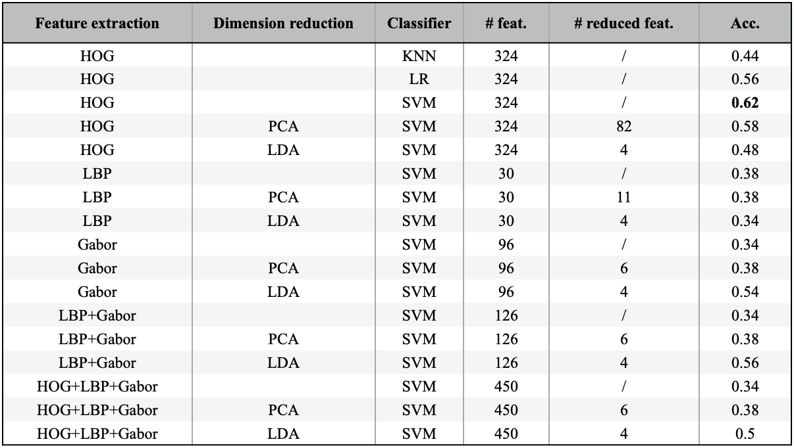
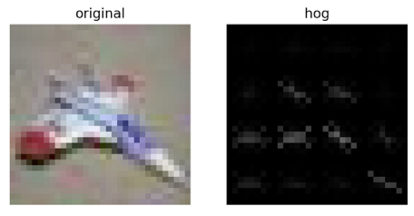
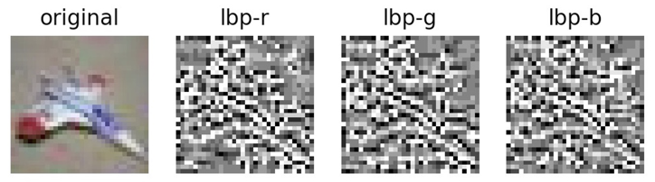

# 2022-DIP-Project2

## 1 Project Content

The project is to perform classification task on part of the CIFAR-10 dataset, with 250 images in train set and 50 images in test set. There are totally 5 classes.

CIFAR-10 is a famous benchmark for image classification. The image size of it is 32*32. The object in it is of various sizes.

In this project, we have to use traditional method to address the problem, which means nothing related to Neural Network.

There are 3 parts of the work: feature extractor, dimension reduction and classifier. We applied 3 methods for feature extractor, 2 methods for dimension reduction and 3 methods for classifier.

## 2 Method Description

### 2.1 Feature Extraction

We use 3 different algorithms to extract feature: **LBP**, **Gabor filter** and **HOG**.

### 2.2 Dimensionality Reduction

We use 2 different algorithms to reduce feature dimensionality: **PCA** and **LDA**.

### 2.3 Classifiers

We use 3 different algorithms to classify: **KNN**, **Logistic Regression** and **SVM**.

## 3 Experiment Results and Analysis

### 3.1 Experiment Results

### 3.2 Comparison between Classifiers

To find out which classifier performs the best, we run three experiments with different classifiers using HOG feature and no dimension reduction algorithms. The results show that SVM has the highest accuracy (0.62), followed by LR (0.56), and KNN is the worst (0.44). This is consistent with our expectation. Therefore, in the following experiments, we adopt SVM as the classifier.

### 3.3 Comparison between Feature Extractors

We conducted several experiments using different feature extractors.

As HOG and LBP features can be easily illustrated, we show the extracted feature of a randomly selected image from the dataset as follows.

(Note that I scaled the LBP features to [0, 255] for better visualization.)

It can be seen that HOG features focus on positions where color or shape change sharply. This corresponds to the theory of HOG, i.e., explore oriented gradient in the image. However, I find it difficult to explain features extracted by LBP.

When no dimension reduction method is used, HOG (0.62) performs much better than LBP (0.38) and Gabor filter (0.34). PCA lowers the performance of HOG a bit and makes Gabor slightly better, but HOG still maintains a significant advantage. However, one interesting thing is that LDA boosts the performance of Gabor, allowing it to even exceed HOG.

To further explore the effect of feature fusion, we combined features extracted by different algorithms through concatenation. However, LBP+Gabor does not give a significantly better result, and they even drag the accuracy of HOG down. We would like to leave the exploration of this strange phenomenon to future work.

### 3.4 The Effect of PCA and LDA

In comparison with methods using and not using PCA, we find that PCA is a really good method to reduce the dimension of the features. For example, with 95% accuracy held, the original 450 dimension are reduced to 6 dimensions, which to some degree shows that the features may have high redundancy. Despite the remarkable result of reduction, the new feature seems not to be easier for the classifier to tell which class the sample belongs to. The accuracy on the test set fluctuates. It may drop or rise a little compared to the same extractors and classifier without PCA. In all, PCA may be a brilliant method to reduce the feature, but it fails to make classifying process easier.

In comparison with methods using and not using LDA, we find its functions vary from different feature extractors. As for HOG and LBP, LDA does no good. The result on the test accuracy only drops. However, things are quite different for Gabor. The result shows that the accuracy rises drastically from 0.34 to 0.56.

